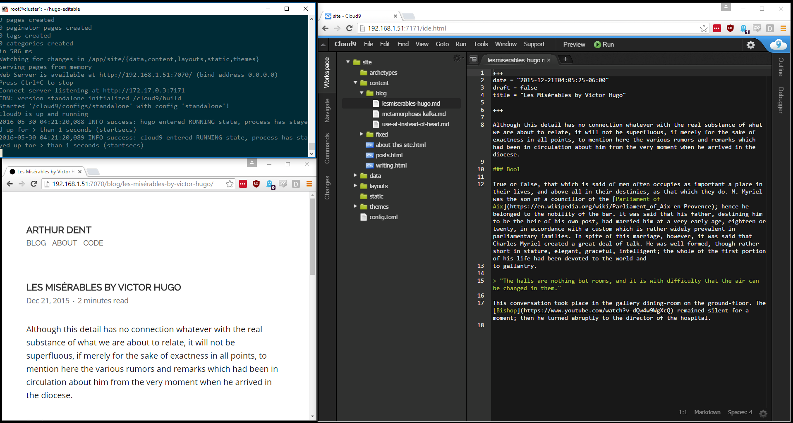

# Hugo Editable

Hugo is awesome. Using it from Docker is cool. Trying to edit files sanely like that is not.

Use this to quickly and easily work on a Hugo site by adding a Cloud9 IDE interface to your Hugo instance.



## Usage

You must define three `ENV` variables and two port mappings so we know: what port and domain Hugo is on and what port Cloud 9 should listen at:

```
# rebuild container, if needed
docker build -t hugo-editable .

# Boot it up!
docker run -ti --rm \
 -p 7070:7070 \
 -e 'HUGO_PORT=7070' \
 -e 'HUGO_BASEURL=http://192.168.1.51' \
 -p 7171:7171 \
 -e 'C9_PORT=7171' \
 -v `pwd`:/app \
 hugo-editable
```

The ports should match inside and out (hugo and c9 both add port to urls and they don't understand the docker abstraction layer), but you can make them whatever you'd like. 

If you do not have a hugo site located under this checkout at `site`, a demo one will be created for you.

Once you're happy with the site, you can use these commands to build an nginx container that serves the full static-built site:

```
# rebuild container, if needed
docker build -t hugo-editable .

# call hugo to statically compile the site to `public`
docker run -ti --rm -v `pwd`:/app -w /app/site hugo-editable hugo --verbose --destination=/app/nginx-static/public -b '/'

# Build the deployable nginx container
docker build -t hugo-static-nginx ./nginx-static

# Run it!
docker run --name hugo-static-nginx -ti --rm -p 80:80 hugo-static-nginx
```

Both of these operations are stored in `dev.sh` and `compile.sh` for easy access.

It is suggested that you clone/fork this repo and then commit back to your own fork your site as you create it.
